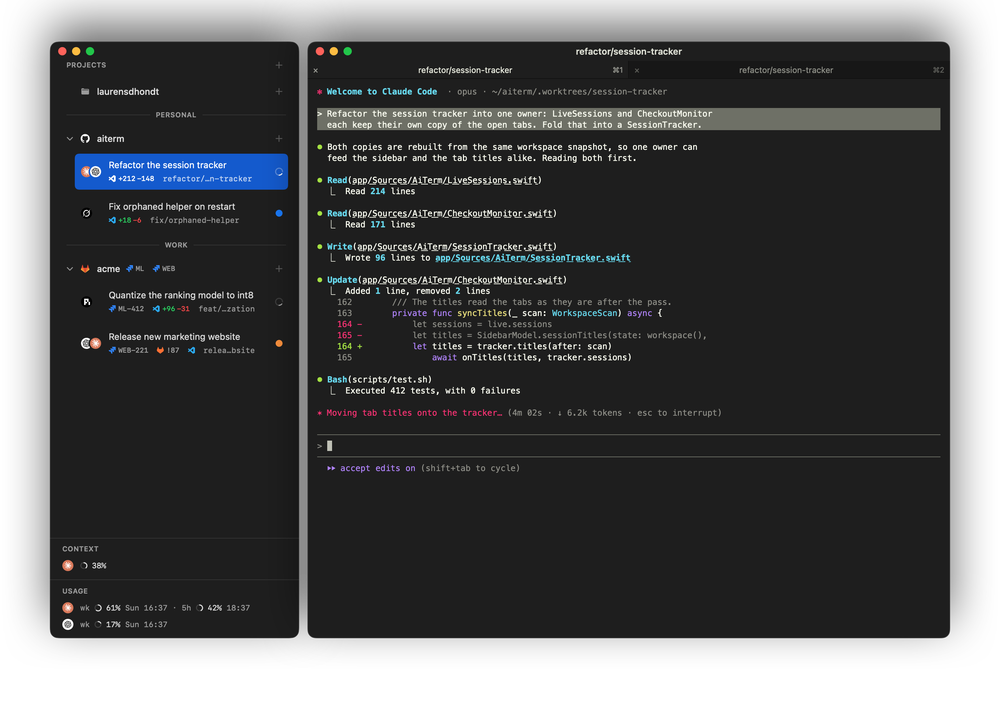

# AiTerm

A native macOS sidebar that turns iTerm2 into a workspace for coding agents: **projects → tasks
(git worktrees) → agent tabs**, with each agent's status and usage at a glance. It drives the real
iTerm2 through its Python API — AiTerm does not embed a terminal.

- Start a task from a Jira ticket: AiTerm creates the worktree and branch, opens an iTerm2 window
  and launches the agent with your prompt.
- See every agent's state — working, waiting for you, done — from Claude Code, Codex, Grok Build
  and PI hooks.
- Review a GitLab merge request or a GitHub pull request in its own worktree.
- Keyboard-first: see [docs/keyboard.md](docs/keyboard.md).

> AiTerm is built for its maintainer's own workflow. Bug reports are welcome; feature requests and
> pull requests are not taken. See [CONTRIBUTING.md](CONTRIBUTING.md).

## Requirements

- macOS 26 or newer
- iTerm2 with its Python API enabled (*Settings › General › Magic › Enable Python API*)
- `python3` 3.11 or newer (`brew install python`) — AiTerm runs its bundled helper with it

## Install

Download the DMG from the [latest release](https://github.com/dhondtlaurens/aiterm/releases/latest),
drag **AiTerm** to Applications and open it. The release is self-signed, so macOS refuses the first
launch: allow it once in *System Settings › Privacy & Security › Open Anyway*. If you copied the app
some other way, clear the download flag first — a quarantined app runs from a temporary copy, and
AiTerm then skips the Claude status line: `xattr -dr com.apple.quarantine /Applications/AiTerm.app`.
After that, *AiTerm › Check for Updates…* installs newer versions in place.

iTerm2 asks once to allow AiTerm's API connection; the sidebar shows "Waiting for iTerm2…" until
you do.

## What AiTerm changes on your machine

- **Agent hooks** — nothing until you press **Install** on an agent's card in *Settings › Agents*;
  until then that agent's status does not reach the sidebar. Install merges hooks into
  `~/.claude/settings.json` or `~/.codex/config.toml`, writes `~/.grok/hooks/aiterm.json` (plus
  Grok's status line in `~/.grok/config.toml`) or the PI extension, and adds a status-line bridge
  for Claude usage. A backup is kept next to every file it edits; the same card repairs or
  reinstalls them.
- **A local port** — the helper listens on `127.0.0.1:47821` for those hooks.
- **Worktrees** — one per task, under `<repo>/.worktrees/`.
- **Its own state and log** — `~/Library/Application Support/AiTerm/`.

The full list is in [docs/architecture.md](docs/architecture.md#what-aiterm-writes-and-where).

> **Codex runs without approvals.** New Codex tasks launch with
> `--dangerously-bypass-approvals-and-sandbox`, which disables Codex's approval prompts and
> sandbox. The New Task command preview shows the flag before anything runs.

## Settings

**Agents** — each agent's CLI, default model and reasoning. **Integrations** — the iTerm2
connection, and Jira, GitLab and GitHub credentials (stored in the Keychain). **Interface** — terminal background, sidebar size,
badges and keyboard shortcuts.

## Known gaps

If you decline iTerm2's permission dialog, or revoke it later, the sidebar stays on "Waiting for
iTerm2…". AiTerm cannot ask again: re-enable the Python API in iTerm2's settings and relaunch
AiTerm.

## Build from source

Needs Swift 6.4 through [Swiftly](https://www.swift.org/install/macos/)
(`swiftly install --use 6.4`); the Command Line Tools compiler is not supported.

    scripts/run-dev.sh    # build build/AiTerm.app and open it in place of the installed one
    scripts/test.sh       # daemon and Swift test suites

A local build is a dev build: a DEV pill on its Dock icon, and no self-update. More in
[scripts/README.md](scripts/README.md); how it works in [docs/architecture.md](docs/architecture.md)
and [docs/status-model.md](docs/status-model.md); the design system in
[app/Sources/AiTermUI/README.md](app/Sources/AiTermUI/README.md).

## Licence

Copyright © 2026 Laurens D'Hondt. AiTerm is free software under the
[GNU General Public License v3.0](LICENSE).

The app bundles the [`iterm2`](https://pypi.org/project/iterm2/) Python package (GPLv2 or later),
[`websockets`](https://pypi.org/project/websockets/) and
[`protobuf`](https://pypi.org/project/protobuf/) (both BSD-3-Clause). Claude, Codex, Grok, PI,
Jira, GitLab and GitHub names and logos belong to their owners and are used only to identify those
tools.
